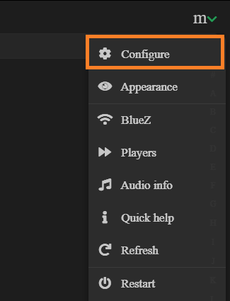
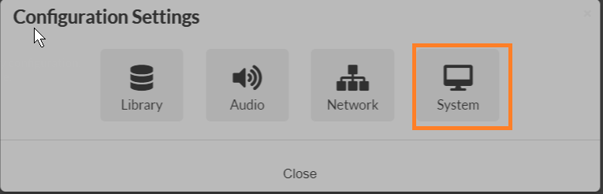
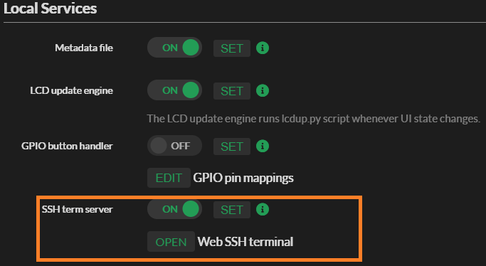
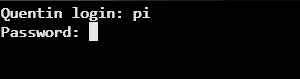
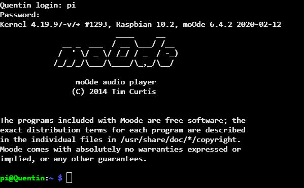

## Pour Activer le SSH sur Moodeaudio

suis les étapes suivante !!!

clique sur Configure



puis sur system !!



Trouve la rubrique Local Services clique sur OFF il devient ON puis SET, puis OPEN



pour l'indenfient et le mot de passe par defaut, c'est :

```
indenfient : pi
mot de passe : moodeaudio
```



Tu es conneter a moodeaudio !! et si tu veux pas l'interface sur ton navigateur alors [clique ici](ssh.md)

